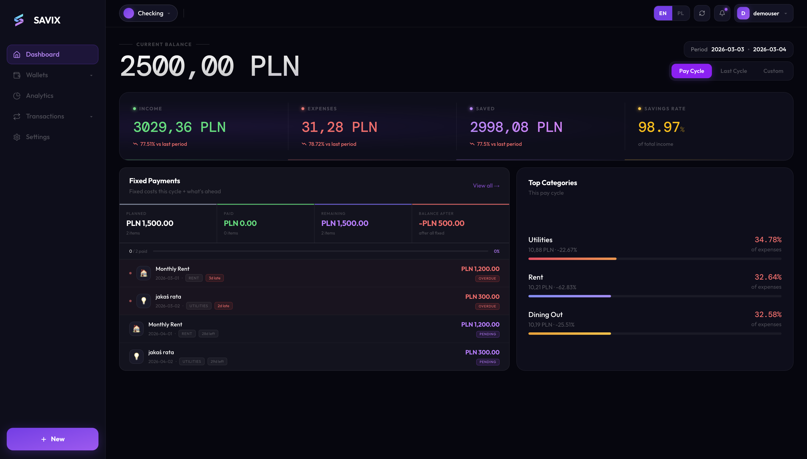
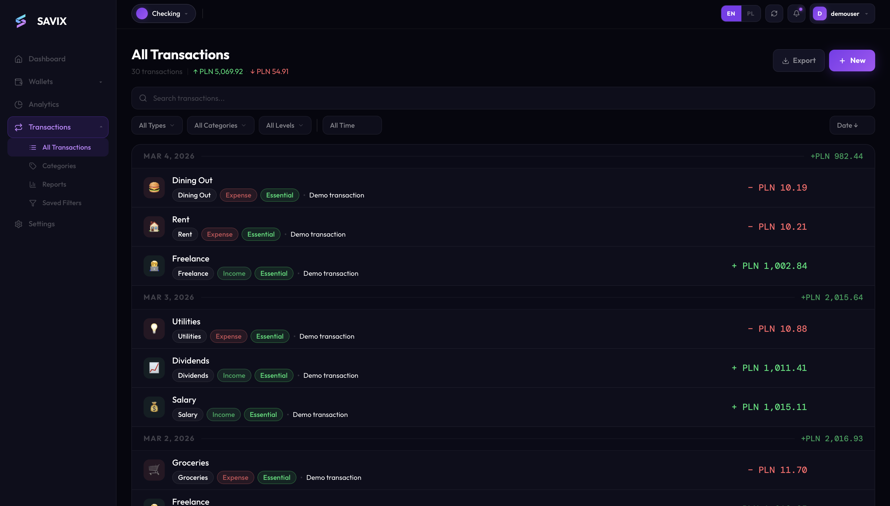
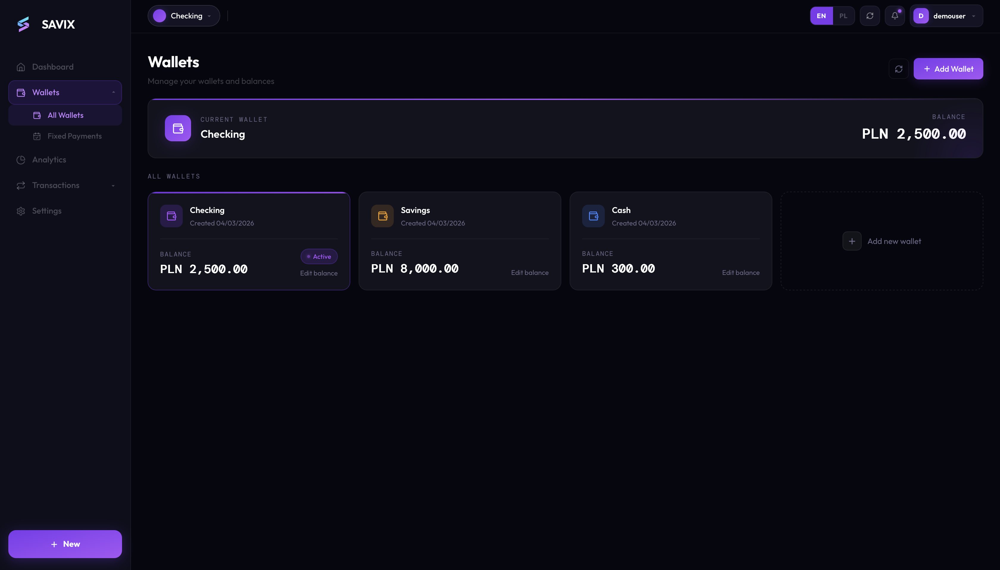

# Savix

**Personal Finance Management App** — Track your income, expenses, wallets, and spending patterns with a clean, modern interface.

Savix is a full-stack monorepo project demonstrating backend architecture built with Spring Boot and a responsive Next.js frontend. Built with a focus on domain modeling, secure authentication, and maintainable code.

[Live Demo](https://savix.mikeshaggy.com) *(access on request)*

---

## Tech Stack

### Backend (Java / Spring Boot)
- **Framework:** Spring Boot with Spring Security, Spring Data JPA
- **Authentication:** JWT (ES256) with HttpOnly cookies, refresh token rotation
- **Database:** PostgreSQL with optimistic locking
- **Caching/Sessions:** Redis for rate limiting and token revocation
- **Email:** Spring Mail with Thymeleaf templates
- **Validation:** Bean Validation with custom password policy
- **Testing:** JUnit 5, H2 in-memory database
- **Build:** Maven with MapStruct, Lombok

### Frontend (Next.js / React)
- **Framework:** Next.js (App Router) with Server Components
- **Styling:** Tailwind CSS v4
- **State Management:** React Context
- **Internationalization:** next-intl (English, Polish)
- **Icons:** Lucide React

### Infrastructure
- **Containerization:** Docker Compose (PostgreSQL, Redis)
- **Deployment:** Docker-based with standalone Next.js output
- **Security:** Cloudflare Tunnel (Zero Trust) in production

---

## Key Features

| Feature | Description |
|---------|-------------|
| **Multi-wallet Management** | Create and manage multiple wallets with real-time balance tracking |
| **Transaction Tracking** | Log income/expenses with categories, importance levels, and notes |
| **Category System** | Custom categories with emoji support for income and expenses |
| **Wallet Transfers** | Move funds between wallets with full audit trail |
| **Ledger Entries** | Immutable journal of all wallet balance changes |
| **Dashboard Analytics** | Income vs. expense summaries, top categories, period filtering |
| **Recurring Transactions** | Support for one-time, weekly, monthly, yearly, and irregular cycles |
| **Importance Tagging** | Classify spending: Essential, Have-to-Have, Nice-to-Have, Investment |
| **Secure Auth** | JWT-based auth with short-lived access tokens and refresh rotation |
| **Password Reset** | Email-based password recovery with rate limiting |
| **Account Lockout** | Brute-force protection with Redis-backed rate limiting |

---

## Project Structure

```
savix-web-app/
├── backend/                    # Spring Boot API
│   └── src/main/java/com/mikeshaggy/backend/
│       ├── auth/               # Authentication (JWT, sessions, password reset)
│       ├── category/           # Category management
│       ├── config/             # Spring configuration (security, Redis, async)
│       ├── dashboard/          # Dashboard aggregation service
│       ├── ledger/             # Wallet entry journal
│       ├── transaction/        # Transaction CRUD with filtering
│       ├── transfers/          # Inter-wallet transfers
│       ├── user/               # User profile management
│       └── wallet/             # Wallet balance management with optimistic locking
│
├── frontend/                   # Next.js application
│   └── src/
│       ├── app/                # App Router pages
│       ├── components/         # React components
│       ├── contexts/           # Global state (auth, wallet, app)
│       ├── hooks/              # Custom React hooks
│       ├── i18n/               # Internationalization config
│       └── lib/                # API client, utilities
│
├── docker-compose.yml          # PostgreSQL + Redis setup
├── 01_init.sql                 # Database schema initialization
└── .env.example                # Environment variables template
```

---

## Local Development Setup

### Prerequisites
- Java 21+
- Node.js 20+
- Docker & Docker Compose

### 1. Clone and configure

```bash
git clone https://github.com/mikeshaggy/savix-web-app.git
cd savix-web-app
cp .env.example .env
# Edit .env with your values
```

### 2. Start infrastructure

```bash
docker compose up -d
```

### 3. Run backend

```bash
cd backend
./mvnw spring-boot:run -Dspring-boot.run.profiles=dev
```

The `dev` profile auto-generates JWT keys for local development.

### 4. Run frontend

```bash
cd frontend
npm install
npm run dev
```

### 5. Access the app

- **Frontend:** http://localhost:3000
- **Backend API:** http://localhost:8080/api

---

## Environment Variables

See [.env.example](.env.example) for all required variables.

| Variable | Description |
|----------|-------------|
| `POSTGRES_*` | PostgreSQL connection settings |
| `REDIS_*` | Redis connection settings |
| `JWT_*` | JWT signing key paths and claims |
| `SMTP_*` | Email server configuration |
| `PROXY_SECRET` | Shared secret for frontend → backend auth |
| `COOKIE_DOMAIN` | Cookie domain for cross-subdomain auth |

---

## Screenshots

<!-- Add screenshots here -->
| Dashboard | Transactions | Wallets |
|-----------|--------------|---------|
|  |  |  |

---

## Architecture Notes

### Backend Focus
This project emphasizes backend engineering:
- **Domain-Driven Design:** Clear separation of concerns with dedicated packages per domain
- **Optimistic Locking:** Wallet balances use `@Version` to prevent race conditions
- **Ledger Pattern:** Every balance change creates an immutable `WalletEntry` for auditability
- **Security First:** Short-lived JWTs (10 min), refresh token rotation, rate limiting, password policy
- **Database Design:** Normalized schema with proper indexes and constraints

### Frontend Note
The frontend UI was scaffolded with AI assistance (GitHub Copilot) to accelerate development. While functional and responsive, the primary focus of this project is the backend architecture, API design, and database modeling.

---

## API Endpoints

| Method | Endpoint | Description |
|--------|----------|-------------|
| `POST` | `/api/auth/register` | Register new user |
| `POST` | `/api/auth/login` | Authenticate and receive tokens |
| `POST` | `/api/auth/refresh` | Refresh access token |
| `POST` | `/api/auth/logout` | Invalidate session |
| `GET` | `/api/wallets` | List user's wallets |
| `GET` | `/api/transactions` | Paginated transactions with filters |
| `GET` | `/api/categories` | List user's categories |
| `GET` | `/api/dashboard` | Dashboard analytics data |
| `GET` | `/api/wallet-entries/wallet/{id}` | Ledger entries for wallet |
| `POST` | `/api/transfers` | Create wallet transfer |

---

## Contributing

This repository is primarily intended as a personal project and portfolio demonstration. Contributions and feedback are welcome.

---

## License

[MIT](LICENSE)

---

## Contact

- [LinkedIn](https://www.linkedin.com/in/michalbagan/)
